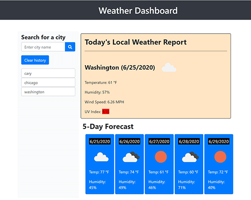

  

# Links to deployed application and repository:
* [Deployed Application](https://sskumar4.github.io/WeatherDashboard/)
* [Repository](https://github.com/sskumar4/WeatherDashboard)

# Project Name: Weather Dashboard
# Title: Weather Dashboard

# Introduction:   
Create weather dashboard using the OpenWeather API and local storage to display weather data for cities.

# Technologies: 
HTML, CSS, bootstrap javascript, axios, api (openweathermap)

# Features
Created the following 
html file: 
  * index.html
js file: 
  * script.js
css file:
  * styles.css

Developed the site with the following features:
  * User is presented with form input to search the weather conditions for a city 
  * The user is presented with current and future conditions for the city of user's choice and that city is added to the search history which is displayed below the input form
  * In the Current Local Weather conditions section, the user is presented with the city name, the date, an icon representation of weather conditions, the temperature, the humidity, the wind speed, and the UV index
  * The UV index is color coded that indicates whether the conditions are favorable, moderate, or severe
  * The 5-day forecast section displays the future weather conditions for that city  with date, an icon representation of weather conditions, the temperature, and the humidity
  * When the user clicks on a city in the search history, the user is again presented with the  current and future conditions for that city
  * If the user opens the weather dashboard application again, the user is presented with the last searched city forecast
  * The Clear history button clears the search history
  
  
Used HTML validation service to ensure that each page has valid HTML.

# Launch

Launch [Deployed Application](https://sskumar4.github.io/WeatherDashboard/) to view the index.